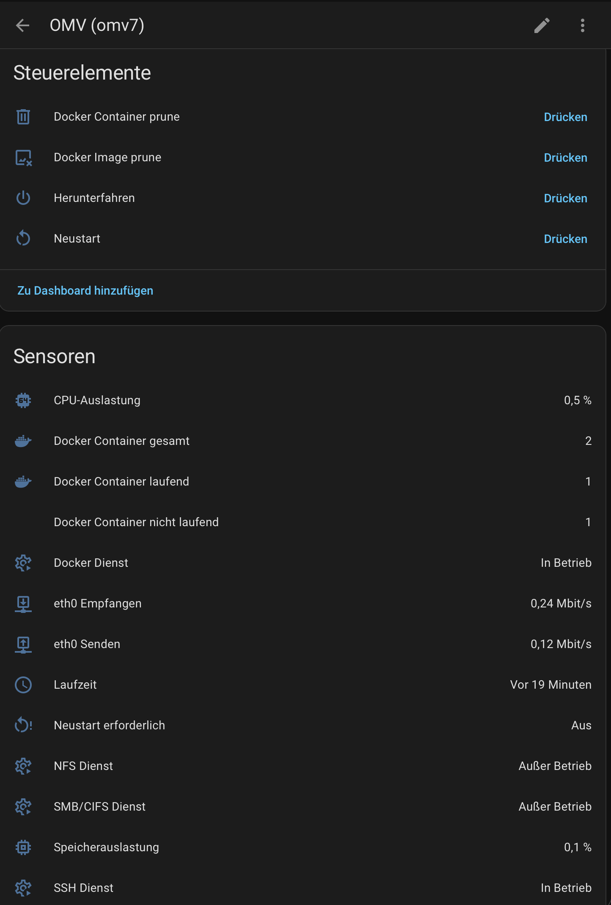
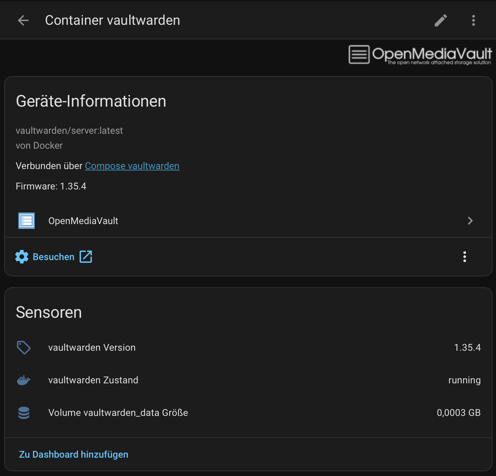
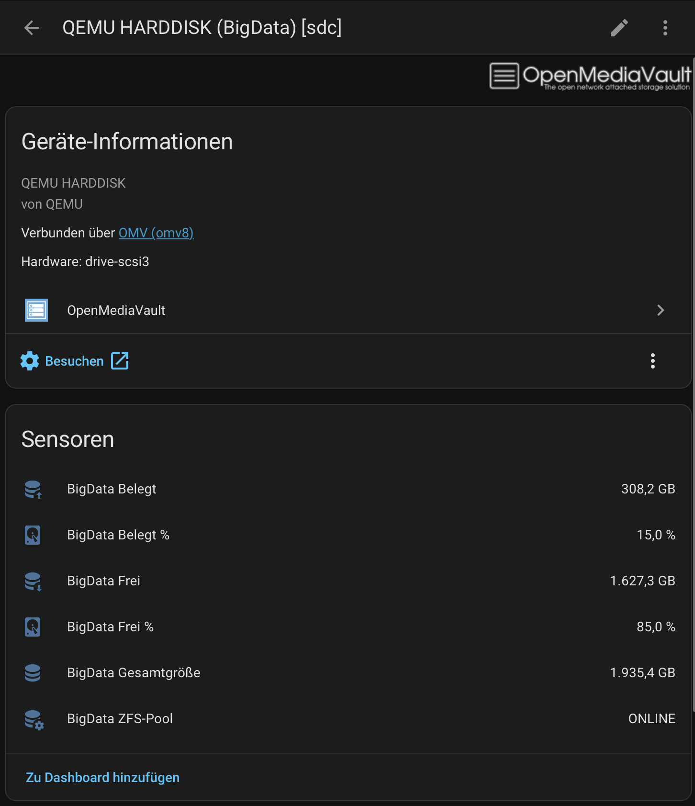
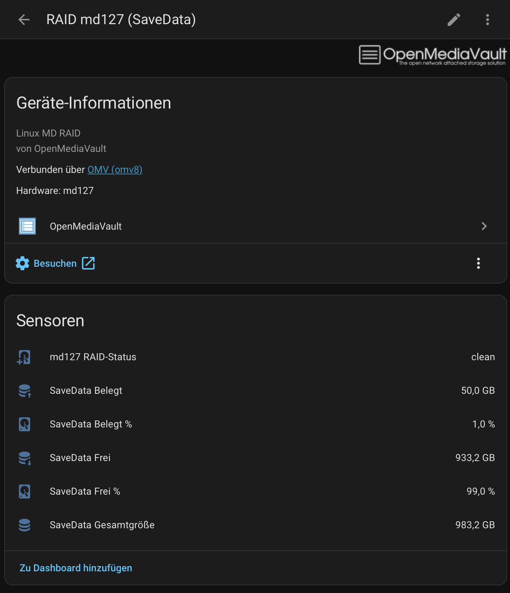
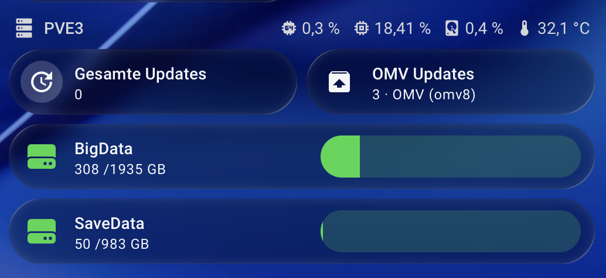

# OpenMediaVault (OMV) for Home Assistant

[](https://hacs.xyz)

Monitor and control your OpenMediaVault NAS from Home Assistant.


## About

This integration is a full modernization of [tomaae/homeassistant-openmediavault](https://github.com/tomaae/homeassistant-openmediavault), building on the groundwork laid by [cneuen/homeassistant-openmediavault](https://github.com/cneuen/homeassistant-openmediavault). Selected compatibility improvements from [Boci-HA/homeassistant-openmediavault](https://github.com/Boci-HA/homeassistant-openmediavault) have also been incorporated.

The original integration relied on a synchronous, poll-based controller that no longer fits the current Home Assistant architecture. This fork replaces that foundation with a native async client, a `DataUpdateCoordinator`-driven update cycle, and a platform structure aligned with modern HA conventions. Alongside that architectural shift, the scope of what the integration monitors has grown substantially: per-resource device modeling, Docker Compose support, ZFS pool awareness, RAID synthesis, dynamic localized entity names, capacity sensors, and a richer options flow are all new additions rather than ports of existing functionality.

## Features

- Async OMV JSON-RPC client based on aiohttp
- DataUpdateCoordinator architecture for predictable polling and updates
- CPU, memory, temperature, filesystem, disk, SMART, network, RAID, and optional ZFS monitoring
- Per-resource device modeling — disks, RAIDs, filesystems, ZFS pools, and Docker containers each appear as separate HA devices
- Docker Compose support with per-container state, version, and lifecycle button entities
- Binary sensors for package updates, reboot requirement, and OMV services
- Reboot and shutdown buttons
- Localized dynamic entity names that follow the active HA language

## Supported Versions

- OpenMediaVault 7 and 8
- Home Assistant 2024.8 or newer

The active integration domain is omv.

## Screenshots







## Installation With HACS

1. Open HACS.
2. Go to Integrations.
3. Add the custom repository https://github.com/slybase/homeassistant-openmediavault.
4. Install OpenMediaVault (OMV).
5. Restart Home Assistant.
6. Add the OMV integration from Settings, Devices & Services.

## Setup

The config flow asks for:

- Host
- Username
- Password
- Port
- SSL
- SSL verification

## Configuration

After setup, the options flow lets you adjust:

- The scan interval
- Whether SMART polling should be disabled
- Virtual passthrough mode for hypervisor-backed setups (e.g. Proxmox) — disables SMART polling and temperature entities automatically
- Which disks, filesystems, network interfaces, services, RAIDs, ZFS pools, Compose projects, and containers are monitored — resources not selected simply disappear from Home Assistant

## Entities

### System (hub device)

- CPU utilization, memory usage, CPU temperature, uptime, available package updates
- Intel iGPU load and current frequency (when available via sysfs)
- Docker container summary: total, running, and not-running counts
- Binary sensors: update available, reboot required
- Buttons: Reboot, Shutdown

### Disk devices (one device per physical disk and logical RAID/md device)

- Temperature
- Used %, free %, used size, free size, total size
- SMART status and SMART attributes (Raw Read Error Rate, Reallocated Sector Count, Pending Sector Count, Uncorrectable Sector Count, Power On Hours, Start Stop Count, Load Cycle Count)

### Filesystem devices (one device per mounted filesystem)

- Used %, free %, used size, free size, total size

### Network interface devices

- TX rate (Mbps), RX rate (Mbps)

### RAID devices

- RAID health status

### ZFS pool devices

- Pool status

### OMV service devices

- Binary sensor: service running / not running

### Docker Compose project devices (one device per project)

- Project status, total containers, running containers, not-running containers
- Buttons: `compose up`, `compose down`, `start`, `stop`, `pull`

### System-wide Docker buttons (on the hub device)

- `docker image prune`, `docker container prune`

### Container devices (one device per container)

- State, status detail, created timestamp, started timestamp, image version
- Volume size (when reported by OMV)

## Development

### Environment

Install the local test and development dependencies with:

```bash
pip install -e ".[test,dev]"
```

### Local Validation

```bash
.venv/bin/python -m ruff check custom_components tests
.venv/bin/python -m pytest tests -q
.venv/bin/python -m pytest tests --cov=custom_components/omv --cov-report=term-missing
```

### Debug Logging

```yaml
logger:
  default: info
  logs:
    custom_components.omv: debug
```

## Compatibility Notes

See docs/omv-rpc-compatibility.md for the current RPC compatibility summary and the live probe workflow for validating OMV7 and OMV8 side by side.